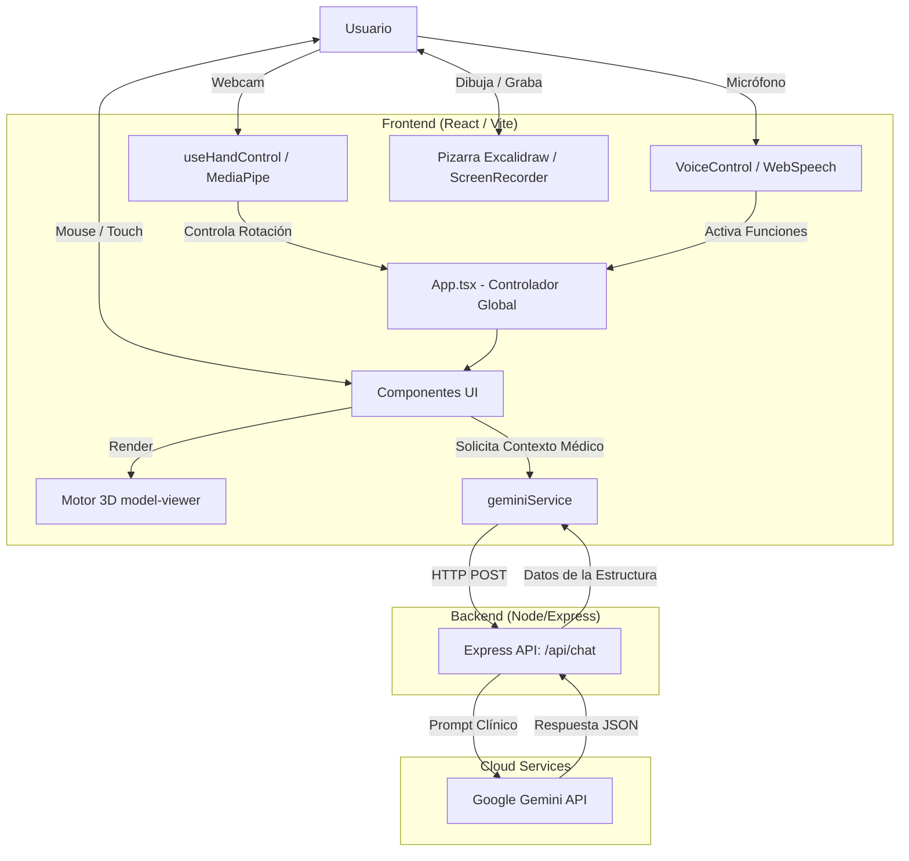

# Documentación de Arquitectura del Sistema AIRSTARK (Actual)

## 1. Visión General
**AIRSTARK** (MedHeart AI) es una aplicación web interactiva y educativa, diseñada como un entorno inmersivo para la enseñanza y exploración de la anatomía cardíaca. El sistema proporciona un modelo 3D del corazón con el que se puede interactuar de múltiples formas (gestos, voz, interfaz gráfica). Además, incorpora herramientas avanzadas como una pizarra colaborativa, grabación de pantalla, monitoreo de signos vitales simulado (EKG) y escáneres CT, complementado con información clínica generada por Inteligencia Artificial (Google Gemini).

## 2. Pila Tecnológica (Tech Stack)

### Frontend (Cliente)
*   **Framework**: React 19 (con TypeScript).
*   **Build Tool**: Vite.
*   **Estilos**: Tailwind CSS para utilidades y animaciones.
*   **Renderizado 3D**: `<model-viewer>` (Componente de Google para interactuar con modelos `.glb`).
*   **Reconocimiento de Gestos**: MediaPipe Hands para detección de manos en tiempo real a través de la webcam.
*   **Reconocimiento de Voz**: Web Speech API (nativo) para comandos de voz.
*   **Pizarra Interactiva**: `@excalidraw/excalidraw` integrado para dibujos y anotaciones sobre el espacio 3D.
*   **Grabación de Pantalla**: MediaRecorder API para captura de video del lienzo y exportación.

### Backend (Servidor)
*   **Runtime**: Node.js.
*   **Framework**: Express.js.
*   **IA/LLM**: Google Gemini API (SDK `@google/genai`).
*   **Seguridad**: Uso de `dotenv` para la API key, middleware de `cors`.

## 3. Arquitectura del Sistema (Cliente-Servidor)

La aplicación sigue una arquitectura moderna centrada en el frontend, delegando en el backend la capa de seguridad y comunicación con los servicios cognitivos de Google.

## 4. Componentes Principales

La interfaz se ha modularizado significativamente para soportar el creciente número de funciones médicas simuladas:

### 4.1. Core y Estado Global
*   **`App.tsx`**: Componente orquestador. Gestiona el estado de los modos de interacción (Exploración, Nav, Quiz), controla si la pizarra está activa (lo cual desactiva las animaciones 3D rotativas), y maneja el estado global del modelo 3D.
*   **`hooks/useHandControl.ts`**: Hook de React que inicializa la cámara web, corre los modelos de detección de MediaPipe y exporta coordenadas de cámara (theta/phi) basadas en la pose de la mano (Palma abierta para mover, Puño para bloquear, etc.).

### 4.2. Paneles Médicos de Información y Simulación
*   **`InfoPanel.tsx`**: Recibe datos dinámicos de Gemini y muestra fisiología, patologías y datos clínicos de la parte del corazón seleccionada.
*   **`EKGMonitor.tsx`**: Un componente visual basado en Canvas de HTML5 que simula un trazado de electrocardiograma (ECG/EKG) animado en tiempo real sincronizado (Sístole/Diástole).
*   **`CTPanel.tsx`**: Panel de simulación de tomografía computarizada/RM para la visualización de cortes médicos.

### 4.3. Herramientas Interactivas y de Creación
*   **`ExcalidrawEditor.tsx`**: Envuelve la librería de Excalidraw. Permite al usuario hacer anotaciones manuscritas, flechas y esquemas sobre la vista 3D. Fundamental para fines educativos.
*   **`ScreenRecorder.tsx`**: Utiliza el DOM para capturar el flujo de video de la aplicación web y grabarlo, permitiendo a los profesores o alumnos guardar sus sesiones de exploración y las anotaciones en Excalidraw.
*   **`VoiceControl.tsx`**: Módulo que escucha en segundo plano los comandos del usuario (por ejemplo, "seleccionar ventrículo", "mostrar información") para operar la app sin usar las manos.

### 4.4. Backend y Servicios
*   **`services/geminiService.ts`**: Lógica frontend para estructurar el prompt dependiendo del contexto (Información General, Patologías, Quiz Clínico).
*   **`server/server.js`**: Protege la API key de Gemini. Es un proxy simple que recibe el prompt del cliente, llama a la API generativa, extrae el texto (JSON parseado) y lo devuelve a la interfaz.

## 5. Flujos de Interacción Complejos

### Modo Pizarra (Whiteboard) + Gestos
Cuando el usuario activa el modo de anotación (Pizarra/Excalidraw):
1. El estado `isWhiteboardOpen` se vuelve `true` en `App.tsx`.
2. Esto provoca que el `<model-viewer>` detenga su rotación automática (disable auto-rotate).
3. Permite al usuario dibujar con precisión sobre el modelo 3D estacionario.
4. Si `useHandControl` está activo, el usuario puede seguir usando gestos para rotar el modelo de fondo mientras dibuja encima, creando una experiencia mixta de realidad aumentada en pantalla.

### Grabación de Sesión Educativa
1. El usuario activa el `ScreenRecorder`.
2. El componente solicita permiso para capturar el flujo de la pestaña (o ventana).
3. Todo lo que sucede en pantalla (modelo 3D moviéndose por gestos, trazos en la pizarra, voz, y el trazado de EKG simulado) se captura en un MediaStream.
4. Al detener la grabación, se genera un archivo de video (WebM/MP4) listo para descarga.

## 6. Siguientes Pasos (Consideraciones Técnicas)
*   **Sincronización EKG-3D**: En el futuro, la velocidad del modelo 3D (latidos) y la animación en Canvas del `EKGMonitor` podrían estar enlazadas por un único contexto de estado.
*   **Seguridad CORS**: El backend actualmente permite todas las conexiones. En producción, requerirá configuración estricta de orígenes permitidos.
*   **Optimización 3D**: Evaluar la compresión de los archivos `.glb` con técnicas como Draco para reducir los tiempos de carga en navegadores web.
