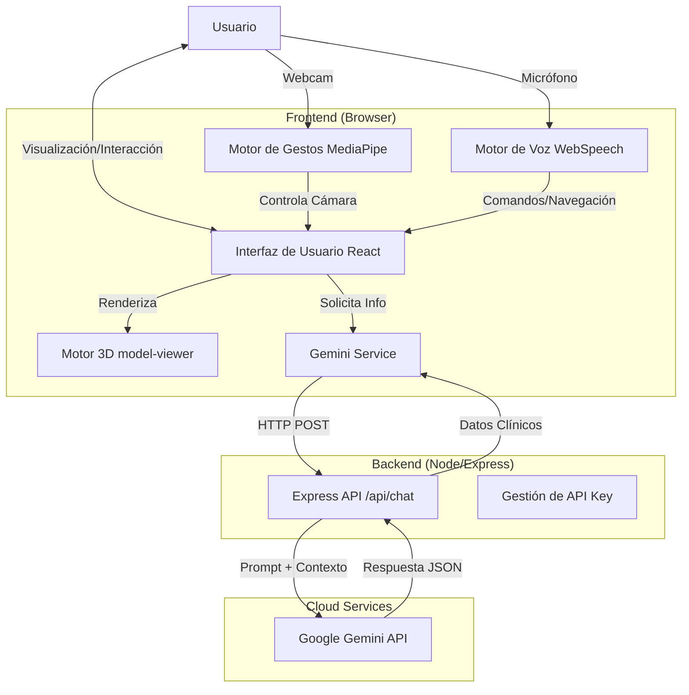

# Documentación de Arquitectura del Sistema AIRSTARK

## 1. Visión General
**AIRSTARK** (MedHeart AI) es una aplicación web interactiva educativa diseñada para la enseñanza y exploración de la anatomía cardíaca en 3D. El sistema permite a los usuarios (estudiantes de medicina, profesionales) visualizar un modelo 3D del corazón, interactuar mediante gestos manuales y comandos de voz, y acceder a información clínica contextualizada generada por Inteligencia Artificial (Google Gemini).

## 2. Pila Tecnológica (Tech Stack)

### Frontend (Cliente)
*   **Framework**: React 19 (con TypeScript).
*   **Build Tool**: Vite.
*   **Estilos**: Tailwind CSS.
*   **3D Rendering**: `<model-viewer>` (Web Component de Google para renderizado 3D/AR fácil).
*   **Reconocimiento de Gestos**: MediaPipe (Google) para detección de manos y gestos en tiempo real.
*   **Reconocimiento de Voz**: Web Speech API (nativa del navegador).

### Backend (Servidor)
*   **Runtime**: Node.js.
*   **Framework**: Express.js.
*   **Seguridad**: `dotenv` para gestión de variables de entorno, `cors` para manejo de orígenes cruzados.
*   **IA/LLM**: Google Gemini API (vía SDK `@google/genai`).

### Modelos y Datos
*   **Modelos 3D**: Formato `.glb` (GL Transmission Format).
    *   `corazon.glb`: Modelo texturizado estándar.
    *   `corazon_transparente.glb`: Modelo para visualización interna.
*   **Datos Anatómicos**: Estructura de datos estática (`ANATOMY_DATA` en `types.ts`) mapeando IDs del modelo 3D a metadatos médicos.

## 3. Arquitectura del Sistema

El sistema sigue una arquitectura **Cliente-Servidor** desacoplada.

## 4. Componentes Principales

### 4.1. Frontend
*   **`App.tsx`**: Controlador principal. Maneja el estado global de la aplicación (Modo, Selección, Cámara) y orquesta los subcomponentes.
*   **`components/InfoPanel.tsx`**: Panel lateral que muestra la información médica (fisiología, patología, etc.) obtenida de la IA.
*   **`hooks/useHandControl.ts`**: Hook personalizado que encapsula la lógica de MediaPipe. Procesa el video de la webcam, detecta marcas de la mano y traduce gestos (puño, palma abierta, etc.) en coordenadas de órbita para la cámara 3D.
*   **`services/geminiService.ts`**: Capa de abstracción para la comunicación con el backend. Define los prompts para el contexto clínico y los quizzes.

### 4.2. Backend (`server/`)
*   **`server.js`**: Punto de entrada.
    *   Mantiene la `GEMINI_API_KEY` segura en el servidor (no expuesta al cliente).
    *   Endpoint `/api/chat`: Recibe un prompt y una instrucción del sistema, consulta a Gemini, y devuelve una respuesta estructurada (JSON).
    *   Manejo de errores y limpieza de respuestas de la IA.

## 5. Flujos de Datos Clave

### A. Exploración Anatómica (IA Generativa)
1.  El usuario hace clic en una parte del corazón (ej. "Ventrículo Izquierdo").
2.  El Frontend llama a `getClinicalContext("Ventrículo Izquierdo")`.
3.  El Service envía una petición POST al Backend con un prompt diseñado para obtener respuesta en JSON.
4.  El Backend consulta a Gemini usando la API Key segura.
5.  Gemini genera datos (Fisiología, Patología, Síntomas, etc.).
6.  El Frontend recibe el JSON y renderiza el `InfoPanel`.

### B. Control por Gestos
1.  El usuario activa la cámara.
2.  `useHandControl` procesa frames de video ~30-60 veces por segundo.
3.  MediaPipe detecta la posición de la mano.
4.  **Lógica de Mapeo**:
    *   *Mano Abierta (Move)*: Mapea la posición X/Y de la mano a los ángulos `theta` y `phi` de la cámara.
    *   *Índice (Zoom)*: Mapea la distancia o posición Y al radio (zoom) de la cámara.
    *   *Puño (Lock)*: Congela la rotación.
5.  El estado `cameraOrbit` de `App.tsx` se actualiza, rotando el modelo 3D en tiempo real.

## 6. Modos de Uso

1.  **Explorar**: Modo predeterminado. Permite seleccionar partes y ver información detallada generada por IA.
2.  **Navegación**: Permite alternar transparencia para ver estructuras internas. Enfocado en la visualización espacial.
3.  **Examen (Quiz)**:
    *   La IA genera una "viñeta clínica" (caso paciente) sin nombrar la estructura.
    *   El usuario debe deducir la estructura y seleccionarla en el modelo 3D.
    *   El sistema valida si la selección es correcta.

## 7. Consideraciones de Seguridad
*   **API Keys**: La clave de Gemini nunca se expone en el código cliente. Reside en el archivo `.env` del servidor.
*   **CORS**: El servidor está configurado para permitir peticiones desde el origen del frontend (actualmente abierto para desarrollo, debe restringirse en producción).

## 8. Estructura de Directorios (Resumen)
root/
├── components/      # Componentes UI (Paneles, Grabadora, etc.)
├── hooks/           # Lógica reutilizable (Gestos)
├── server/          # Backend Express
│   └── server.js    # Lógica del servidor
├── services/        # Conexión con APIs
├── public/          # Assets estáticos (Modelos 3D .glb)
├── App.tsx          # Lógica principal
└── types.ts         # Definiciones de tipos TypeScript
